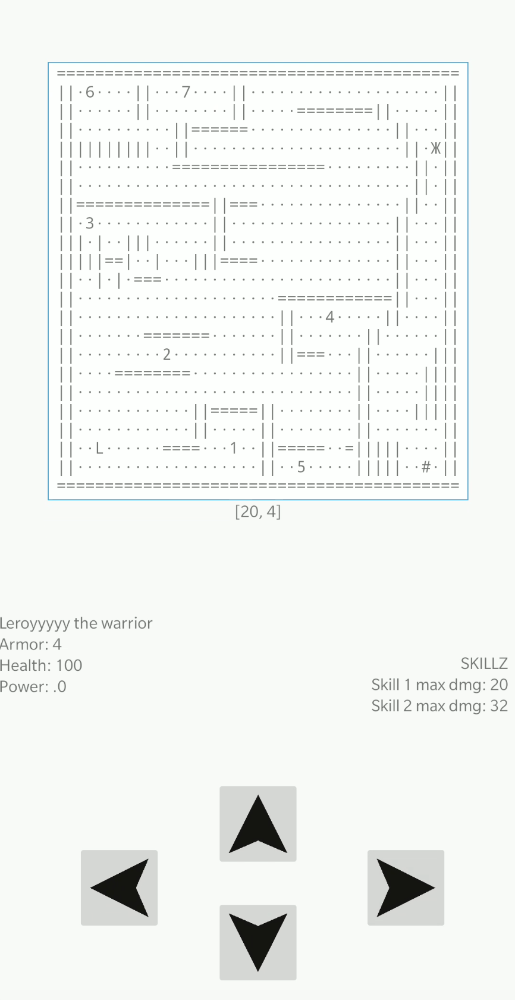

# Zodiac Adventures
> ASCII rogue-like adventure game

Create your character and defeat monsters (numbers) to level up. The goal is to become strong enough to defeat the Wise Dragon. If you die, game over!



## Installation

https://play.google.com/store/apps/details?id=com.leemartinc.zodiacadventures


## Usage example

Its an adventure game. Download it and try it out

## Development setup


```
Project was created with Android studio and can be set up with the same tool
```

## Release History

* 0.0.1
    * Initial Bare minimum release with win condition

## Meta

Lee-Martin Clarke – https://leemartinclarke.com


## Contributing

1. Fork it (<https://github.com/leemartinc/Zodiac-Adventures---Android/fork>)
2. Create your feature branch (`git checkout -b feature/fooBar`)
3. Commit your changes (`git commit -am 'Add some fooBar'`)
4. Push to the branch (`git push origin feature/fooBar`)
5. Create a new Pull Request

